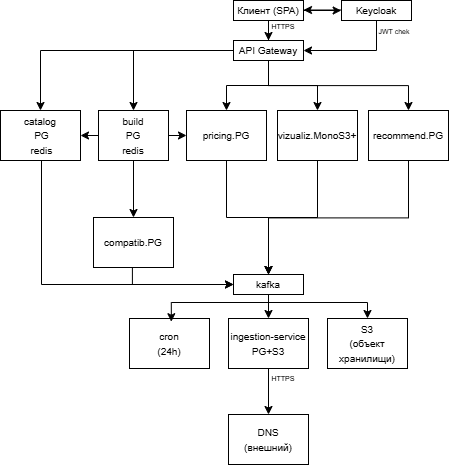
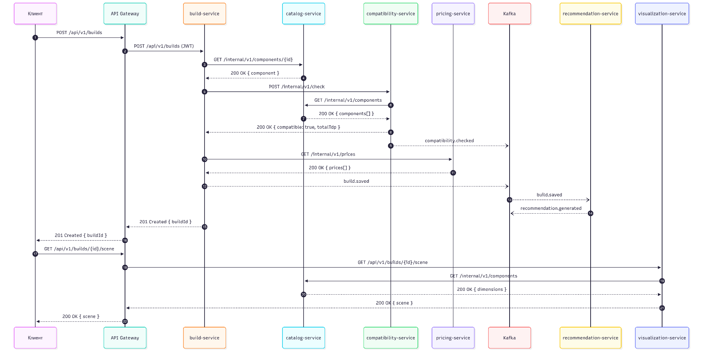
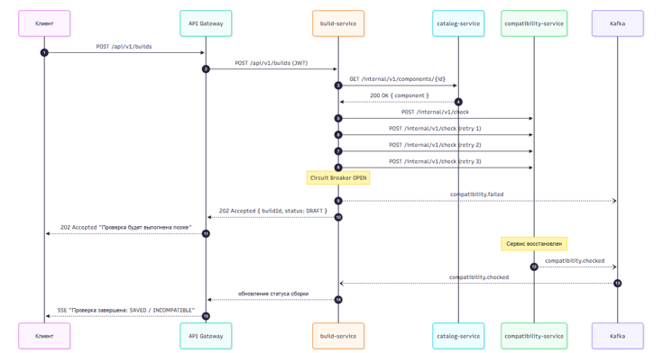

# Лабораторная работа №3. Декомпозиция и проектирование микросервисной системы

**Предметная область:** Веб-конфигуратор сборки персонального компьютера с 3D-визуализацией, проверкой совместимости, расчётом энергопотребления и тепловыделения.

---

## 1. Описание предметной области, акторы, пользовательские сценарии

### 1.1. Что делает система

Система позволяет пользователю собрать персональный компьютер из комплектующих (процессор, материнская плата, видеокарта, оперативная память, накопители, блок питания, корпус, охлаждение), автоматически проверяет их совместимость, рассчитывает суммарное энергопотребление и тепловыделение, показывает реалистичную 3D-визуализацию сборки с учётом реальных габаритов деталей, рассчитывает итоговую стоимость и сохраняет конфигурацию для последующего просмотра и публикации. Каталог комплектующих синхронизируется с внешним источником (DNS) раз в 24 часа фоновым планировщиком.

### 1.2. Акторы

| Актор | Роль |
|---|---|
| Пользователь | Собирает ПК, сохраняет и публикует сборки, читает рекомендации |
| Администратор | Управляет каталогом, правилами совместимости, текстами подсказок, запускает ручную синхронизацию |
| Внешний источник (DNS) | Предоставляет каталог, цены, характеристики, изображения |
| Объектное хранилище (S3/MinIO) | Хранит 3D-модели и изображения |
| Keycloak | Аутентификация и авторизация |
| Cron | Планировщик, запускает синхронизацию раз в 24 часа |

### 1.3. Ключевые пользовательские сценарии

1. Как пользователь, я хочу просматривать каталог комплектующих с фильтрами, чтобы выбрать подходящие детали.
2. Как пользователь, я хочу добавлять комплектующие в сборку и видеть проверку совместимости в реальном времени, чтобы не купить несовместимые детали.
3. Как пользователь, я хочу видеть 3D-визуализацию собранного ПК, чтобы оценить, как это будет выглядеть.
4. Как пользователь, я хочу видеть суммарное энергопотребление и тепловыделение, чтобы понять, хватит ли БП и охлаждения.
5. Как пользователь, я хочу сохранять и делиться сборкой, чтобы вернуться к ней позже или показать друзьям.
6. Как пользователь, я хочу получать рекомендации по обслуживанию на основе своей сборки.
7. Как администратор, я хочу запускать синхронизацию каталога с DNS и видеть статус, чтобы данные были актуальными.
8. Как система, я хочу автоматически обновлять каталог раз в 24 часа, чтобы цены и наличие не устаревали.

---

## 2. Доменные события и ограниченные контексты с глоссариями

### 2.1. Доменные события (в прошедшем времени)

- `CatalogSyncRequested` — запрошена синхронизация каталога
- `CatalogSyncCompleted` — синхронизация завершена успешно
- `CatalogSyncFailed` — синхронизация провалилась
- `CatalogUpdated` — каталог обновлён
- `PriceChanged` — цена изменилась
- `BuildCreated` — сборка создана
- `BuildItemAdded` — компонент добавлен в сборку
- `BuildItemRemoved` — компонент удалён из сборки
- `BuildSaved` — сборка сохранена
- `BuildPublished` — сборка опубликована
- `CompatibilityChecked` — совместимость проверена
- `RecommendationGenerated` — рекомендации сформированы
- `SceneRequested` — сцена запрошена

### 2.2. Ограниченные контексты

**2.2.1. Каталог комплектующих**

- Комплектующее — товарная позиция с характеристиками.
- Категория — тип (CPU, GPU, Motherboard, RAM, Storage, PSU, Case, Cooler).
- Характеристика — типизированное поле (socket, TDP, wattage, length_mm).
- Габариты — физические размеры в миллиметрах.

**2.2.2. Сборка**

- Сборка — набор выбранных комплектующих.
- СлотСборки — позиция компонента в сборке (CPU-слот, GPU-слот и т. д.).
- Статус сборки — DRAFT / SAVED / PUBLISHED / ARCHIVED / STALE.

**2.2.3. Совместимость**

- Правило — условие совместимости (например, socket CPU = socket MB).
- РезультатПроверки — список нарушений и предупреждений.
- ИтоговоеЭнергопотребление — сумма TDP + запас.
- Тепловыделение — суммарный тепловой пакет.

**2.2.4. Цены**

- Цена — текущая стоимость на дату.
- Прайс — снимок цен на момент синхронизации.
- ИсточникЦены — DNS / ручной ввод.

**2.2.5. Визуализация**

- Модель3D — .glb-файл, привязанный к комплектующему.
- Сцена — состояние 3D-сцены: какие модели, где стоят.
- Anchor — точка крепления модели (PCIe-слот, сокет, стойка).

**2.2.6. Рекомендации**

- Правило — условие + текст подсказки.
- Рекомендация — сформированный текст под конкретную сборку.

**2.2.7. Ingestion (синхронизация с DNS)**

- RawSnapshot — сырой ответ парсера.
- SyncJob — задача синхронизации со статусом.
- SourceMapping — соответствие sourceId ↔ internalId.

### 2.3. Глоссарии

- **Каталог:** «Комплектующее» — товарная позиция с уникальным артикулом, характеристиками и габаритами.
- **Сборка:** «Сборка» — контейнер для выбранных комплектующих, принадлежащий пользователю.
- **Совместимость:** «Правило» — предикат, возвращающий true/false для пары компонентов.
- **Визуализация:** «Сцена» — пространственная компоновка моделей, привязанная к сборке.
- **Ingestion:** «SyncJob» — задача синхронизации с внешним источником.

---

## 3. Карточки сервисов и отвергнутые варианты разбиения

### 3.1. catalog-service

| Поле | Значение |
|---|---|
| Ответственность | Хранение и выдача каталога комплектующих и их характеристик |
| Владеет данными | Комплектующее, Категория, Характеристика |
| Предоставляет | GET /api/v1/components, GET /api/v1/components/{id}, GET /api/v1/categories; событие catalog.updated |
| Зависит от | Подписан на ingestion.batch.ready |
| НФТ | Высокая частота чтения (×100 к записи), кэшируется в Redis, latency < 100 мс |
| Обоснование границы | Каталог читается постоянно, пишется редко; масштабируется и кэшируется отдельно от бизнес-логики сборки |

### 3.2. build-service

| Поле | Значение |
|---|---|
| Ответственность | Управление сборками пользователя, добавление и удаление компонентов, публикация сборок |
| Владеет данными | Сборка, СлотСборки |
| Предоставляет | POST /api/v1/builds, GET /api/v1/builds/{id}, POST /api/v1/builds/{id}/items, DELETE /api/v1/builds/{id}/items/{itemId}, POST /api/v1/builds/{id}/publish; события build.created, build.item.added, build.item.removed, build.saved, build.published |
| Зависит от | Синхронно: catalog-service, compatibility-service, pricing-service. Подписан на catalog.updated, price.changed, compatibility.checked |
| НФТ | Средняя нагрузка, критичность UX (если упадёт — нельзя делать сборку), latency < 300 мс |
| Обоснование границы | Ядро бизнеса, собственная сложная логика, изменяется независимо от каталога и цен |

### 3.3. compatibility-service

| Поле | Значение |
|---|---|
| Ответственность | Проверка правил совместимости, расчёт энергопотребления и тепловыделения |
| Владеет данными | Правило, РезультатПроверки |
| Предоставляет | POST /internal/v1/check, POST /api/v1/builds/{id}/validate; событие compatibility.checked |
| Зависит от | Синхронно: catalog-service |
| НФТ | CPU-bound (работа упирается в процессор), горизонтально масштабируется, latency < 200 мс |
| Обоснование границы | Правила меняются независимо от каталога и сборки; сложная доменная логика, вынесена из build-service |

### 3.4. pricing-service

| Поле | Значение |
|---|---|
| Ответственность | Хранение актуальных цен, расчёт стоимости сборки, история цен |
| Владеет данными | Цена, Прайс, ИсторияЦен |
| Предоставляет | GET /api/v1/prices, GET /internal/v1/prices/{componentId}; событие price.changed |
| Зависит от | Подписан на catalog.updated |
| НФТ | Обновляется раз в 24 ч, читается часто, кэшируется, latency < 100 мс |
| Обоснование границы | Цены — отдельный контекст с собственным жизненным циклом и внешним источником |

### 3.5. visualization-service

| Поле | Значение |
|---|---|
| Ответственность | Выдача 3D-моделей и метаданных сцены для сборки; масштабирование по реальным габаритам |
| Владеет данными | Модель3D, МетаданныеСцены |
| Предоставляет | GET /api/v1/models/{componentId}, GET /api/v1/builds/{id}/scene; событие scene.ready |
| Зависит от | Синхронно: catalog-service. Подписан на catalog.updated, build.item.added |
| НФТ | Большие бинарные файлы, кэшируются CDN, latency < 500 мс |
| Обоснование границы | Работа с тяжёлыми ассетами требует отдельного хранилища (S3/MinIO) и CDN |

### 3.6. recommendation-service

| Поле | Значение |
|---|---|
| Ответственность | Выдача рекомендаций по обслуживанию и подсказок по сборке на основе правил |
| Владеет данными | Правило, Подсказка, ИсторияРекомендаций |
| Предоставляет | GET /api/v1/builds/{id}/recommendations; событие recommendation.generated |
| Зависит от | Синхронно: build-service. Подписан на build.saved, build.item.added |
| НФТ | Низкая нагрузка, latency < 200 мс |
| Обоснование границы | Правила подсказок меняются независимо от правил совместимости; это отдельная бизнес-возможность |

### 3.7. ingestion-service

| Поле | Значение |
|---|---|
| Ответственность | Фоновая синхронизация каталога комплектующих с внешним источником (DNS) раз в 24 часа; нормализация данных |
| Владеет данными | RawSnapshot, SyncJob, SourceMapping (снимок ответа парсера, запись о запуске, соответствие идентификаторов в БД и DNS) |
| Предоставляет | POST /internal/v1/sync, GET /internal/v1/sync/{jobId}; события ingestion.batch.ready, ingestion.failed |
| Зависит от | Внешний источник (DNS), объектное хранилище |
| НФТ | Фоновая работа, не критичен к latency, таймауты |
| Обоснование границы | Внешние источники нестабильны; их сбой не должен ронять каталог. Изоляция «грязной» интеграционной логики |

### 3.8. Отвергнутые варианты разбиения

- **Объединить catalog-service и pricing-service.** Отказались: цены обновляются из внешнего источника и требуют истории; каталог статичнее. Разные темпы изменений → разные сервисы.
- **Объединить build-service и compatibility-service.** Отказались: правила совместимости CPU-bound, меняются чаще логики сборки. Разные НФТ.
- **Ввести user-service.** Отказались: аутентификацию выполняет Keycloak, отдельный сервис пользователей не нужен.
- **Ввести order-service.** Отказались на этапе MVP: заказ — отдельная бизнес-возможность, будет добавлена позже.

---

## 4. Таблица выбранного ПО с обоснованием

| Компонент | Кто использует | Обоснование |
|---|---|---|
| PostgreSQL (отдельная БД на сервис) | catalog, build, compatibility, pricing, recommendation, ingestion | Транзакции, связи между сущностями (сборка ↔ компоненты), строгая схема для правил |
| Redis | catalog, build | Кэш каталога (чтение ×100 к записи), сессии, короткоживущие блокировки, distributed lock для sync-job |
| MongoDB | visualization | Гибкая схема метаданных 3D-сцен: разные наборы полей для разных моделей |
| MinIO (S3) | visualization, ingestion | Хранение .glb-моделей и изображений; CDN-совместимость; raw snapshots для аудита |
| Apache Kafka | build, catalog, pricing, ingestion, recommendation | События читают несколько независимых подписчиков; повторное чтение; порядок по ключу |
| API Gateway (Kong / Spring Cloud Gateway / Nginx) | Вход для клиента | Маршрутизация, проверка JWT, rate limiting, единая точка входа |
| Keycloak | Gateway | OAuth 2.0 / OpenID Connect без собственной реализации |
| Elasticsearch (опционально) | catalog | Полнотекстовый поиск по комплектующим, фасетные фильтры |

---

## 5. Схема взаимодействий

### 5.1. Архитектурная схема

Исходник: [docs/architecture.drawio](docs/architecture.drawio)

### 5.2. Диаграмма последовательности — успешный путь

Исходник: [docs/diagram_succes.mmd](docs/diagram_succes.mmd)

### 5.3. Диаграмма последовательности — сбой на шаге проверки совместимости

Исходник: [docs/diagram_failed.mmd](docs/diagram_failed.mmd)

### 5.4. Таблица взаимодействий

| № | Инициатор → получатель | Тип | Эндпоинт / событие | Назначение |
|---|---|---|---|---|
| 1 | client → catalog | sync | GET /api/v1/components | Каталог с фильтрами |
| 2 | client → build | sync | POST /api/v1/builds | Создать сборку |
| 3 | build → catalog | sync | GET /internal/v1/components/{id} | Получить характеристики |
| 4 | build → compatibility | sync | POST /internal/v1/check | Проверить совместимость |
| 5 | compatibility → catalog | sync | GET /internal/v1/components | Получить характеристики |
| 6 | build → pricing | sync | GET /internal/v1/prices | Получить цены |
| 7 | client → visualization | sync | GET /api/v1/builds/{id}/scene | Получить сцену |
| 8 | client → recommendation | sync | GET /api/v1/builds/{id}/recommendations | Получить подсказки |
| 9 | ingestion → Kafka | async | ingestion.batch.ready | Батч готов к применению |
| 10 | catalog ← Kafka | async | ingestion.batch.ready | Обновить каталог |
| 11 | catalog → Kafka | async | catalog.updated | Уведомить build, pricing, visualization |
| 12 | pricing ← Kafka | async | catalog.updated | Обновить цены |
| 13 | pricing → Kafka | async | price.changed | Уведомить build |
| 14 | build → Kafka | async | build.saved, build.item.added | Уведомить recommendation, visualization |
| 15 | compatibility → Kafka | async | compatibility.checked | Уведомить build |
| 16 | recommendation ← Kafka | async | build.saved | Сгенерировать рекомендации |
| 17 | ingestion → Kafka | async | ingestion.failed | Алерт администратору |

---

## 6. Перечень событий: топик, издатель, подписчики, ссылка на схему

| Топик | Издатель | Подписчики | Ссылка на схему |
|---|---|---|---|
| ingestion.batch.ready | ingestion-service | catalog-service | [asyncapi.yaml](api/asyncapi.yaml) |
| ingestion.failed | ingestion-service | админ-алерт | [asyncapi.yaml](api/asyncapi.yaml) |
| catalog.updated | catalog-service | pricing-service, build-service, visualization-service | [asyncapi.yaml](api/asyncapi.yaml) |
| price.changed | pricing-service | build-service | [asyncapi.yaml](api/asyncapi.yaml) |
| build.saved | build-service | recommendation-service | [asyncapi.yaml](api/asyncapi.yaml) |
| build.item.added | build-service | compatibility-service, visualization-service | [asyncapi.yaml](api/asyncapi.yaml) |
| build.item.removed | build-service | compatibility-service, visualization-service | [asyncapi.yaml](api/asyncapi.yaml) |
| compatibility.checked | compatibility-service | build-service | [asyncapi.yaml](api/asyncapi.yaml) |
| recommendation.generated | recommendation-service | build-service | [asyncapi.yaml](api/asyncapi.yaml) |

---

## 7. Ссылки на OpenAPI-файлы

- [catalog-service.yaml](api/catalog-service.yaml)
- [build-service.yaml](api/build-service.yaml)
- [compatibility-service.yaml](api/compatibility-service.yaml)
- [pricing-service.yaml](api/pricing-service.yaml)
- [visualization-service.yaml](api/visualization-service.yaml)
- [recommendation-service.yaml](api/recommendation-service.yaml)
- [ingestion-service.yaml](api/ingestion-service.yaml)
- [asyncapi.yaml](api/asyncapi.yaml)